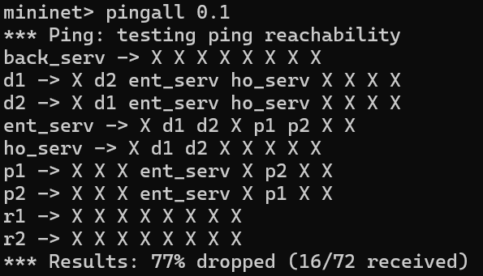
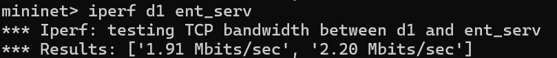
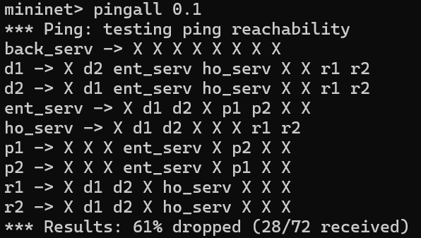
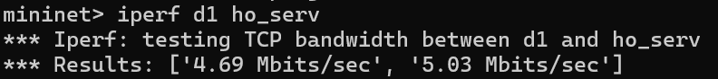
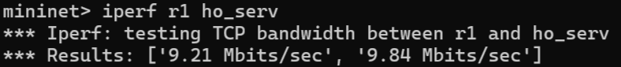
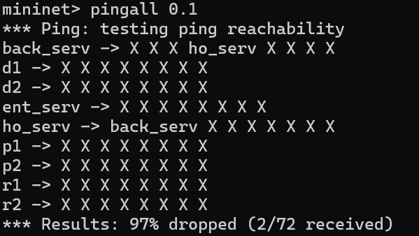
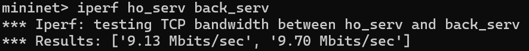
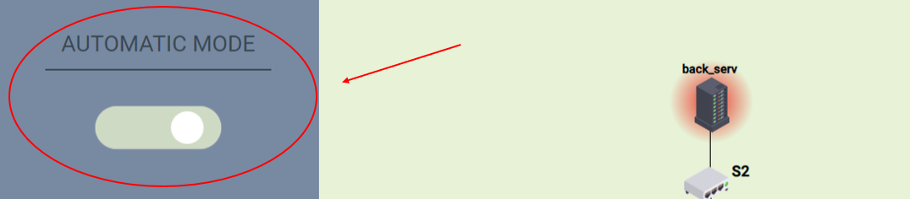
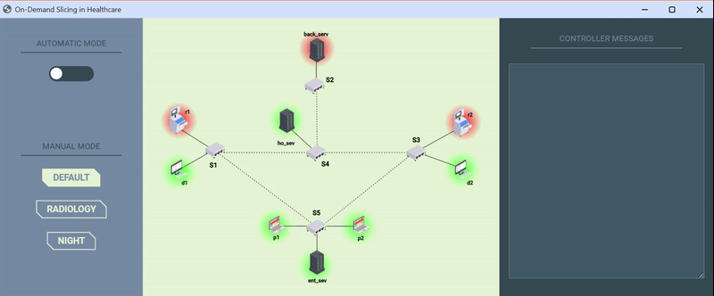

# On Demand SDN Slicing - Healthcare Application
The goal of the project "On Demand SDN Slicing - Helthcare Application" is to implement a Network Slicing approach to enable dynamic activation/de-activation of network slices via CLI/GUI commands. 

## Table of Contents
- [Introduction](#Introduction)
- [Scenario 1 - DEFAULT](#scenario-1---default)
- [Scenario 2 - RADIOLOGY](#scenario-2---radiology)
- [Scenario 3 - NIGHT](#scenario-3---night)
- [Automatic Mode](#automatic-mode)
- [GUI](#gui)
- [Installation and Configuration](#installation-and-configuration)
- [How to run](#how-to-run)
- [Presentation](#presentation)
- [Contributors](#contributors)

## Introduction
Our project involves the application of network slicing in the context of a private medical clinic. The latter, in a realistic scenario, consists of a waiting room for patients, two medical clinics equipped with radiology machinery, and a server room for the management of clinical data. 

The network infrastructure that allows communication between the various hosts within the clinic is defined as follows:
- 1 SDN Controller
- 5 OpenFlow switches (`s1`, `s2`, `s3`, `s4`, `s5`)
- 9 Hosts, including:
    - 2 doctors (`d1`, `d2`)
    - 2 radiology machinery (`r1`, `r2`)
    - 2 patients (`p1`, `p2`)
    - `ent_serv` server for the entertainment of patients and doctors in leisure time
    - `ho_serv` server for the management of clinical data
    - `back_serv` backup server


<p align="center">
  
</p>

Network resource management can be summarised in three main scenarios, presented below.

## Scenario 1 - DEFAULT 
### Overview
This scenario represents the daily base mode for the clinic. On the days when this scenario is enabled, the radiology slice is deactivated, while the doctors can communicate with each other and with the clinical data server. During breaks they have access to the entertainment server.

Patients in the waiting room can communicate with each other and connect to the entertainment server, but they will not have access to the clinic's sensitive information.

<p align="center">
  
</p>

### Tests
By running `pingall`, you can see which hosts a single host can reach, and the output will display the network structure mentioned earlier.

<p align="left">
  
</p>

To verify the accuracy of the network bandwidth, you can check the bandwidth between two hosts via `iperf <host1> <host2>` command.
This image shows an example of fast link in our network:

<p align="left">
  
</p>

While this image shows an example of slow link in our network:

<p align="left">
  
</p>


## Scenario 2 - RADIOLOGY 
### Overview
On the days when the clinic offers radiology services, the slice consisting of the radiology machines is activated. The doctors can then connect to the machines, the machines can save data to the clinical data server, and more bandwidth will be reserved for them.

<p align="center">
  
</p>

### Tests
By running `pingall`, you can see which hosts a single host can reach, and the output will display the network structure mentioned earlier.

<p align="left">
  
</p>

To verify the accuracy of the network bandwidth, you can check the bandwidth between two hosts via `iperf <host1> <host2>` command.
This image shows an example of fast link in our network:

<p align="left">
  
</p>

<p align="left">
  
</p>

As can be seen from the two images above, the activation of the radiology machines makes it possible for the latter to have a larger bandwidth, thus reducing the one dedicated to doctors.

## Scenario 3 - NIGHT
### Overview
During the night, it is possible to enable this scenario, where the only active hosts are _ho_serv_ and _back_serv_, allowing for overnight backup of clinical data.

<p align="center">
  
</p>


### Tests
By running `pingall`, you can see which hosts a single host can reach, and the output will display the network structure mentioned earlier.

<p align="left">
  
</p>

To verify the accuracy of the network bandwidth, you can check the bandwidth between two hosts via `iperf <host1> <host2>` command.

<p align="left">
  
</p>


## Automatic Mode
Through the GUI you can activate the automatic mode, which allows you to alternate the various modes, simulating an automatic operation for a real context.

<p align="center">
  
</p>

## GUI
<p align="center" text-align="center">
  
  <br>
  <span><i>Demo</i></span>
</p>

## Project Structure
```
On-Demand-SDN-Slices  
├── GUI: static content for GUI  
│   ├── Images  
│   ├── GUI.css  
│   └── GUI.html  
├── scenarios: definition of paths for the various scenarios  
│   ├── default.py  
│   ├── night.py  
│   └── radiology.py  
├── GUI.py: file to run the GUI based on the eel library for Python  
├── QoS_and_queue.sh  
├── ryu_controller.py: SDN controller  
├── topology.py: definition of the network structure (hosts, switches and links)  
└── utils.py  
```

## Installation and Configuration

1. Connect with a Comnetsemu portale or install all the functionalities in your system

2. Per il funzionamento del progetto è richiesta:
- l'installazione su ambiente Comnetsemu del progetto
- installazione locale del file _GUI.py_ e della directory _GUI_
- sempre in locale, per l'esecuzione della GUI, install the required python packages by running pip install r requirements.txt inside the WebApp folder.


## How to run 
1. Run the controller in Comnetsemu: `$ sudo ryu-manager ryu_controller.py`
2. Open a local terminal to run the GUI: `$ python .\GUI.py`
3. Open another VM terminal to create the mininet network: `$ sudo python3 topology_slicing.py`
4. In the Mininet interface, you can now assess both the connectivity and bandwidth between hosts. Using the GUI, you have the ability to manipulate scenarios dynamically and observe their corresponding outcomes.
5. Once you finish testing the network, safely exit Mininet by using the command `mininet> exit`, followed by `$ sudo mn -c`.

## Presentation

## Contributors
Anna Dal Mas - anna.dalmas@studenti.unitn.it  
Sabrina Vinco - sabrina.vinco@studenti.unitn.it  
Simone Bragantini - simone.bragantini@studenti.unitn.it  